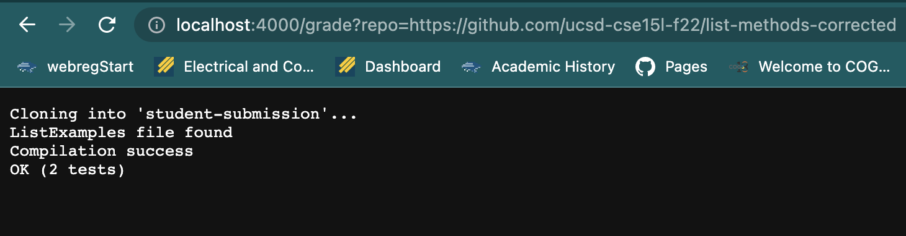
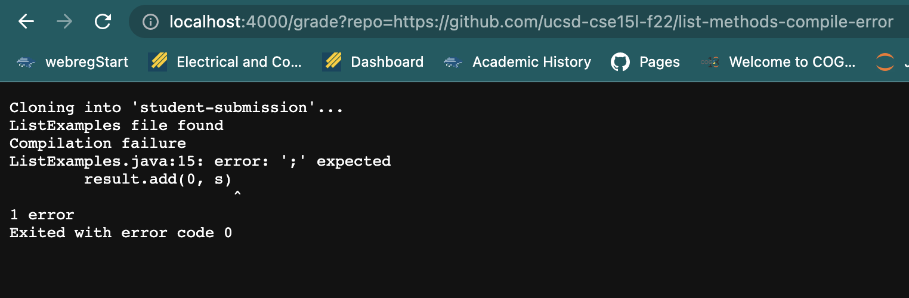
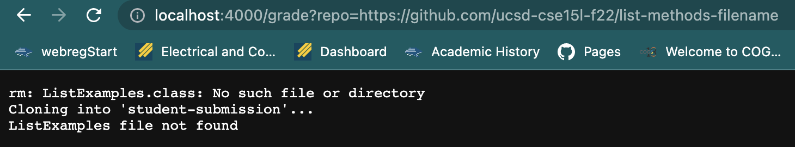

Grade.sh code:
```ruby
rm -rf student-submission
rm ListExamples.java
rm ListExamples.class
git clone $1 student-submission

if [ -e "student-submission/ListExamples.java" ]
then
	echo "ListExamples file found"
	cp student-submission/ListExamples.java ./
	javac -cp .:lib/hamcrest-core-1.3.jar:lib/junit-4.13.2.jar *.java 2> error.txt
	if [ -s error.txt ]
	then
		echo "Compilation failure"
		echo "$(cat error.txt)"
		echo "Exited with error code $?"
		exit
	else
		echo "Compilation success"
		java -cp .:lib/hamcrest-core-1.3.jar:lib/junit-4.13.2.jar org.junit.runner.JUnitCore TestListExamples > output.txt
		echo "$(cat output.txt | tail -n2)"

	fi
else
	echo "ListExamples file not found"
fi
```
examples on a server:




I will trace down what the grade.sh does on the first image, which is a repository that has everything corrected:

first, on the first 4 lines
```ruby
rm -rf student-submission
rm ListExamples.java
rm ListExamples.class
git clone $1 student-submission
```
the script initialize the directory by removing repetitive files and clone the student's repository. The exit code should be 0.

Next, the script checks if the file name"ListExamples.java" exists or not. 
```ruby
if [ -e "student-submission/ListExamples.java" ]
then
```
In this case, it does, so it's going to run the following if statement.

Next, the script tells us that the file exist and runs Junit on 'ListExamples.java' and redirect stderr to a file
```ruby
echo "ListExamples file found"
cp student-submission/ListExamples.java ./
javac -cp .:lib/hamcrest-core-1.3.jar:lib/junit-4.13.2.jar *.java 2> error.txt
```
Since all the method in this file is correct, there is no stderr. Hence, the next if statement will not run
```ruby
if [ -s error.txt ]
	then
```
instead, it will run the else statement and redirect the Junit output to a file and echo it to us
```ruby
else
	echo "Compilation success"
	java -cp .:lib/hamcrest-core-1.3.jar:lib/junit-4.13.2.jar org.junit.runner.JUnitCore TestListExamples > output.txt
	echo "$(cat output.txt | tail -n2)"
```
